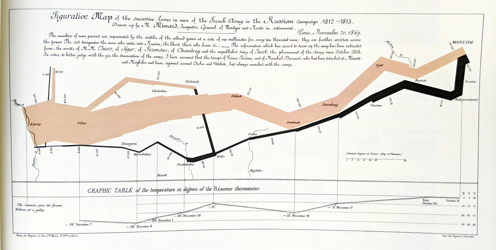
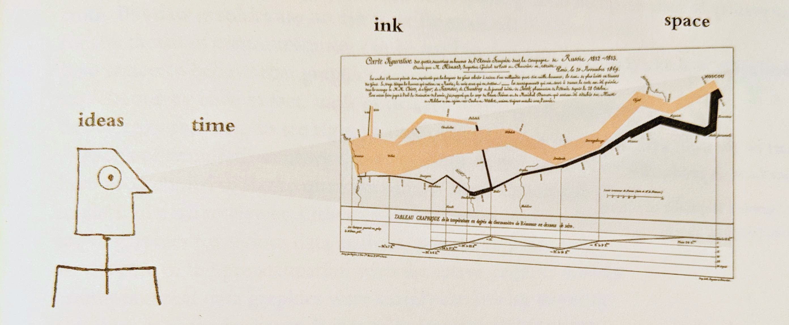

```{r setup, include = FALSE}
knitr::opts_chunk$set(echo = F, message = F, warning = F)
```

```{r, echo = FALSE}
library(tufte)
```

# Narrative Graphics of Space and Time 

`r newthought("An especially effective device")` for enhancing the explanatory power of time-series displays is to add spatial dimensions to the design of the graphic, so that the data are moving over space (in two or three dimensions) as well as over time. Excellent space-time-story graphics illustrate here how multivariate complexity can be subtly integrated into graphical architecture, integrated so gently and unobtrusively that viewers are hardly aware that they are looking into a world of four or five dimensions. Occasionally graphics are belligerently multivariate, advertising the technique rather than the data. But not this one.

The classic figure below of Charles Joseph Minard (1781-1870), the French engineer, shows the terrible fate of Napoleon's army in Russia. Described by E.J. Marey as seeming to defy the pen of the historian by its brutal eloquence,[^1] this combination of data map and time-series, drawn in 1869, portrays a sequence of devastating losses suffered in Napoleon's Russian campaign of 1812. Beginning at left on the Polish-Russian border near the Niemen River, the thick tan flow-line shows the size of the Grand Army (422,000) as it invaded Russia in June 1812. The width of this band indicates the size of the army at each place on the map. In September, the army reached Moscow, which was by then sacked and deserted, with 100,000 men. The path of Napoleon's retreat from Moscow is depicted by the darker, lower band, which is linked to a temperature scale and dates at the bottom of the chart. It was a bitterly cold winter, and many froze on the march out of Russia. As the graphic shows, the crossing of the Berezina River was a disaster, and the army finally struggled back into Poland with only 10,000 men remaining. Also shown are the movements of auxiliary troops, as they sought to protect the rear and the flank of the advancing army. Minard's graphic tells a rich, coherent story with its multivariate data, far more enlightening than just a single number bouncing along over time. Six variables are plotted: the size of the army, its location on a two-dimensional surface, direction of the army's movement, and temperature on various dates during the retreat from Moscow. Minard's French original was printed as a two-color lithograph in the form of a small poster.

It may well be the best statistical graphic ever drawn.

[^1]: E. J. Marey, *La méthode graphique* (Paris, 1885), 73. For more on Minard, see Arthur H. Robinson, "The Thematic Maps of Charles Joseph Minard," *Imago Mundi*, 21 (1967), 95-108.

::: {.fullwidth}

:::

`r margin_note("Image from *Charles Joseph Minard Tableaux Graphiques et Cartes Figuratives de M. Minard, 1845-1869*, Bibliothéquede l'École Nationale des Ponts et Chaussées, Paris, item 28 (62 by 25 cm, or by in). English translation by Dawn Finley and redrawing by Elaine Morse, completed August 2002.")`

The figure's caption reads as follows:

> The numbers of men present are represented by the widths of the colored zones at a rate of one millimeter for every 10,000 men; they are further written across the zones. The red designates the men who enter into Russia, the black those who leave it.

> The information which has served to draw up the map has been extracted from the works of M. M. Chiers, of Segur, of Frezensac, of Chambray and the unpublished diary of Jacob, the pharmacist of the Army since October 28th. In order to better judge with the eye the diminution of the army, I have assumed that the troops of Prince Jérome and of Marshal Davoush who had been detached at Minsknd Moghilev and have rejoined around Orcha and Vitebsk, had always marched with the army.

# Exercises

1. What two-dimensional datasets do you find in Minard's figure?

* temperature vs. time
* troops vs. location
* returning troops vs. time
* troops who broke of from main army vs. location
* troops who died vs. rivers crossed
*

2. Create at least a few alternative figures of your own using the data you've found using your plotting tool of choice.

It is first instructive to collect observed data and put it into tables.

```{r}
library(tidyverse)
library(googlesheets4)
library(kableExtra)

gs4_deauth()
data_loc <- "https://docs.google.com/spreadsheets/d/1sDJeCLtLGNvBLb6_NJW-fuas2T3UU_Yi7DOCCQqO3ps"
read_gsheet <- function(data_location, sheet_id){
      googlesheets4::read_sheet(data_location, sheet = sheet_id, skip = 0, col_types = "c")
}

# Present various tables from graphical data
advance <- read_gsheet(data_loc, "advance")
advance %>% kable(caption = "Number of troops advancing toward Moscow.")
rearAndFlank <- read_gsheet(data_loc, "rearAndFlank")
rearAndFlank %>% kable(caption = "Number, type, and location of troops who broke off from majority.") 
return <- read_gsheet(data_loc, "return")
return %>% kable(caption = "Number of troops returning toward Kovno with additional data.") 
```
Next, we can make some plots.

```{r, fig.cap = "Troop numbers advancing toward Moscow, then returning to Kovno."}
advanceReturn <-
bind_rows(advance %>% mutate(type = "advance") %>% select(city, troops, type),
          return  %>% mutate(type = "return")  %>% select(city, troops, type)
          )

advanceReturn$city <- 
  factor(advanceReturn$city,
         levels=c("kovno","vilna","molodechno","minsk","bobr","vitebsk","orcha","smolensk","dorobouj","viarma","gjat","maroyaraslovets","moscow")
         )

advanceReturn$troops <- as.numeric(advanceReturn$troops)

ggplot(advanceReturn %>% na.omit(), aes(city, troops, color = type)) + geom_point() +
  theme(axis.text.x = element_text(angle = 45, vjust = 1, hjust=1))
```
```{r, fig.cap = "Looking for temperature effects. Interesting jump in deaths on coldest night!"}
return$troops <- as.numeric(return$troops)
return$temp <- as.numeric(return$temp)
return$date <- as.Date(return$date)

returnCompare <-
  return %>%
  select(date, temperatureInDegreesRankine=temp, troops) %>%
  reshape2::melt(id.vars = c("date"), value.name = "value") %>%
  na.omit()

returnCompareDiff <-
  return %>%
  select(date, troops) %>%
  na.omit() %>%
  mutate(deaths = lag(troops) - troops) %>%
  select(-troops) %>%
  reshape2::melt(id.vars = c("date"), value.name = "value")

pltReturn <- bind_rows(returnCompare, returnCompareDiff)

pltReturn$variable = factor(pltReturn$variable, levels=c('troops', 'temperatureInDegreesRankine', 'deaths'))

ggplot(pltReturn, aes(date, value)) +
  geom_point() +
  geom_line() +
  facet_wrap(~variable, scales = "free_y", dir = "v")
```

3. Compare Minard's figure to yours. Reflect on the legendary status of Minard's figure.

See next section.

# Principles of Graphical Excellence

Graphical excellence is the well-designed presentation of interesting data---a matter of *substance*, of *statistics*, and of *design*.

Graphical excellence consists of complex ideas communicated with clarity, precision, and efficiency.

Graphical excellence is that which gives to the viewer the greatest number of ideas in the shortest time with the least ink in the smallest space.



Graphical excellence is nearly always multivariate.

And graphical excellence requires telling the truth about the data.

`r margin_note("Brief and slightly modified excerpts were adapted from Edward Tufte's *The visual display of quantitative information,* 2001, and is for educational purposes only.")`